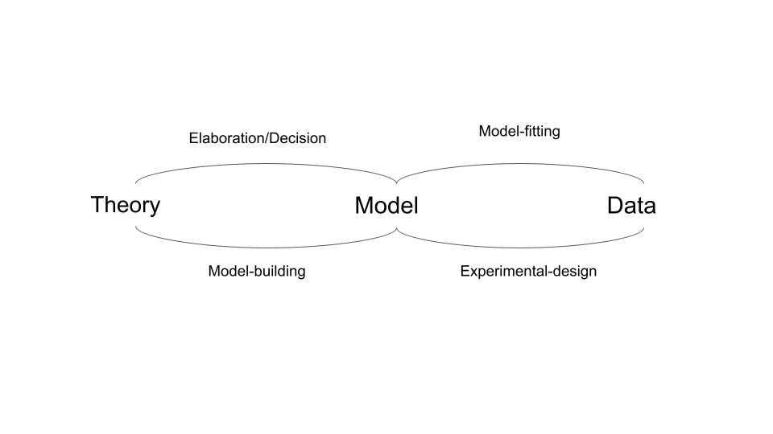
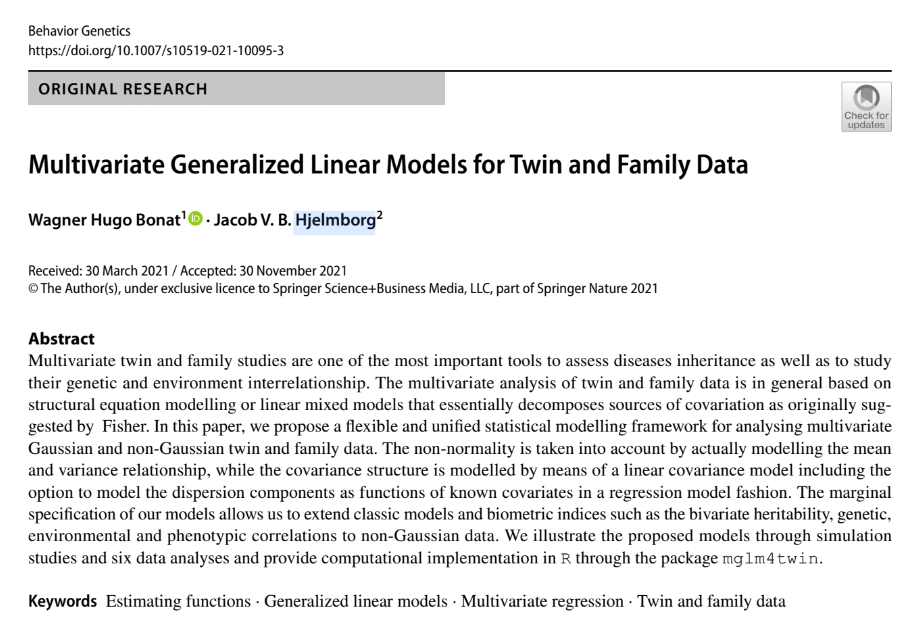

```{r, include = FALSE}
source("./config/setup.R")
```

# Motivation

## Heredity and variation

\beginAHalfColumn

- Genetic epidemiology is impelled by three basic questions:
    1. Why isn't everyone the same?
    2. Why are children like their parents?
    3. Why aren't children from the same parents all alike?

- **Main goal: Isolate/Separate sources of variation!**

\endColumns
\beginAHalfColumn

- Variation is everywhere!

```{r, echo = FALSE, message = FALSE, out.width='100%', fig.height=5, fig.width=10, fig.align='center', fig.cap = 'Histogram of height and weight.'}
library(mglm4twin)
library(ggplot2)
library(dplyr)
library(tidyr)
data(anthro)
anthro %>%
  pivot_longer(names_to = 'Trait',
               values_to = 'response',
               cols = -c(Group, Twin, age, Twin_pair)) %>%
ggplot() +
  geom_histogram(aes(response), bins = 20) +
  facet_wrap(~Trait, scales = "free")
 
```

\endColumns


## Motivating dataset: Anthropometric measures

\beginAHalfColumn

- Anthropometric measurements (weight and height).
- 861 twin pairs: 327 DZ (dizygotic) and 534 MZ (monozygotic).
- Bivariate continuous traits.
- Covariates: age and group.
- Available as an example in the OpenMx package (Neale, et al., 2016).
- Easy access from the `mglm4twin` package.

\endColumns
\beginAHalfColumn

```{r, echo = FALSE, out.width='80%', fig.height=8, fig.width=10, message = FALSE, fig.cap = "Photo by Pixabay."}
knitr::include_graphics("./img/balanca.jpg")

```

\endColumns

## Motivating dataset: Anthropometric measures

- The dataset

```{r}
library(mglm4twin)
data(anthro)
glimpse(anthro)
```


## Graphing and Quantifying Familial Resemblance

```{r, echo = FALSE, out.width='80%', fig.height=5, fig.width=10, message = FALSE, fig.cap = "Dispersion diagram by zygosity · Trait weight."}
data_graph <- anthro %>% select(weight, Twin, Twin_pair, Group) %>%
  pivot_wider(names_from = 'Twin_pair',
              values_from = c('weight')) 
names(data_graph)[3:4] <- c("Twin_1", "Twin_2")
ggplot(data_graph) +
  geom_point(aes(y = Twin_1, x = Twin_2)) +
  geom_smooth(aes(y = Twin_1, x = Twin_2), method = 'lm') +
  facet_wrap(~ Group, scales = "free")

```

## Multiple traits

```{r, echo = FALSE, out.width='80%', fig.height=5, fig.width=10, message = FALSE, fig.cap = "Dispersion diagram by zygosity · Weight vs Height."}
data_graph2 <- anthro %>% select(weight, height, Twin, Twin_pair, Group) %>%
  pivot_wider(names_from = 'Twin_pair',
              values_from = c('height', 'weight'))
ggplot(data_graph2) +
  geom_point(aes(y = height_1, x = weight_1)) +
  geom_smooth(aes(y = height_1, x = weight_1), method = 'lm') +
  facet_wrap(~ Group)
```

## Building and Fitting Models

```{r, echo = FALSE, out.width='75%', fig.height=8, fig.width=10, message = FALSE, fig.cap = "Diagram of the interrelationship between theory, model and empirical observation. Adapted from Neale and Maes (1992)."}

```

## Challenges for model-building in Twin data analyses

\beginAHalfColumn

- Decompose sources of variation
    1. Genetic Effects.
    2. Environmental Effects.
    3. Genotype-Environment Interaction.

- Traits types
    1. Binary and binomial data.
    2. Bounded data and continuous proportions.
    3. Under-, equi- and over-dispersed count data.
    4. Semi-continuous data (continuous $+$ mass at zero).
    5. Symmetric and assymetric continuous data.

- Multiple traits of mixed types.

\endColumns
\beginAHalfColumn


```{r, echo = FALSE, out.width='80%', fig.height=8, fig.width=10, message = FALSE, fig.cap = "Photo by Magda Ehlers from Pexels."}


```

\endColumns

## Importance and statistical approaches

- Multivariate twin and family studies are important tools to:
    1. Determine traits inheritance;
    2. Determine the influence of genetic and environmental effects on traits.
- Statistical challenge:
    1. Model the covariance structure to take into account the genetic 
    and environmental structures induced by the twin and family designs.
- Orthodox approaches:
    1. Structural equation modelling (SEM);
	  2. Linear mixed models (LMM).
- Main limitations of SEM and LMM:
    1. Both deal only with Gaussian (symmetric) data;
    2. Standard computational implementations are difficult to 
    adapt for the analysis of twin and family data.


# Multivariate generalized linear models

## Multivariate generalized linear models (mglm): What is it?


- Flexible statistical modelling framework to deal with multivariate traits.
- Tailored for twin and family data by Bonat and Hjelmborg (2022).
- The mglm approach deals with:
    1. Binary and binomial data;
    2. Bounded data and continuous proportions;
    3. Under-, equi- and over-dispersed count data.
    4. Semi-continuous data (continuous $+$ mass at zero);
    5. Symmetric and assymetric continuous data.
    6. Combination of all the previous mentioned data.
- Estimation and inference based on estimating functions (Bonat and Jorgense, 2016).
- Computational implementation available through the `mglm4twin` package.

## Multivariate generalized linear models (mglm): Non-standard features

\beginAHalfColumn

- Extend standard measures of genetic studies such as: 
    1. Bivariate heritability, environmentability and common environmentability; 
    2. Genetic, environmental and phenotypic correlations, 

to non-Gaussian traits.

- Provide a flexible framework for modelling the dispersion parameters as functions of potential covariates.
- Provide software implementation in \texttt{R}.

\endColumns
\beginAHalfColumn

```{r, echo = FALSE, out.width='80%', fig.height=8, fig.width=10, message = FALSE, fig.cap = ""}


```

\endColumns

# Multivariate generalized linear models for twin data

## Generalized linear models for twin data
- Let $Y_{i}$ be a $2 \times 1$ random vector of the i$th$ twin pair for $i = 1, \ldots, n$.
- Let $\mathbf{x}_{i} = (x_{i1}, \ldots, x_{ik})^{\top}$ denote a $2 \times k$ design matrix.
- Let $\boldsymbol{\beta}$ be a $k \times 1$ parameter vector.
- Consider $(y_{i},\mathbf{x}_{i})$, where $y_{i}'s$ are iid realizations of $Y_{i}$ according 
to an \textbf{unspecified} bivariate distribution, whose expectation and variance are given by
\begin{eqnarray}
\label{modelGLM}
\mathrm{E}(Y_i) &=& \mu_i = g^{-1}(\mathbf{x}_{i}^{\top}\beta)  \nonumber \\
\mathrm{var}(Y_i) &=& \Sigma_i = \mathrm{V}(\mu_i;p)^{\frac{1}{2}}\Omega\mathrm{V}(\mu_i;p)^{\frac{1}{2}}.
\end{eqnarray}
- $g$ some suitable link function.
- $\mathrm{V}(\mu_i;p) = \mathrm{diag}(\vartheta(\mu_i;p))$, where $\vartheta(\mu_i;p)$ describes the mean and variance relation and $p$ is the power parameter (to be estimated).
- $\Omega$ is a $2 \times 2$ dispersion matrix.

## Generalized linear models for twin data
- The models decompose the covariance matrix into two components.
$$ \mathrm{var}(Y_i) = \Sigma_i = \mathrm{V}(\mu_i;p)^{\frac{1}{2}}\Omega\mathrm{V}(\mu_i;p)^{\frac{1}{2}}$$
- $\mathrm{V}(\mu_i;p)$ deals with non-Gaussianity.
- Variance/dispersion functions
    1. $\vartheta(\mu;p) = \mu^p$ characterizes the Tweedie distribution deals with continuous and semi-continuous data. Gaussian $(p=0)$, Gamma $(p=2)$ and inverse Gaussian $(p=3)$.
    2. $\vartheta(\mu;p) = \mu + \tau \mu^p$ characterizes the Poisson-Tweedie 
    distribution deals with count data. Neyman-type A $(p=1)$, negative binomial $(p=2)$ and PIG $(p=3)$.
    3. $\vartheta(\mu;p) = \mu^p (1- \mu)^p$ generalization of binomial variance function 
    deals with binary, binomial and bounded data.
- $p$ is an index that identifies the distribution.
- In practice, we estimate $p$ which works as an automatic model selection.

## Generalized linear models for twin data
- $\Omega$ models the dependence between twin pair.
- Polygenic ACDE model has the components
\begin{equation*}
\label{components}
\mathrm{A} = \begin{bmatrix}
1 & a\\ 
a & 1
\end{bmatrix}, \quad
\mathrm{C} = \begin{bmatrix}
1 & 1\\ 
1 & 1
\end{bmatrix}, \quad
\mathrm{D} = \begin{bmatrix}
1 & d\\ 
d & 1
\end{bmatrix}\quad \text{and} \quad
\mathrm{E} \begin{bmatrix}
1 & 0\\ 
0 & 1
\end{bmatrix}.
\end{equation*}
- Dispersion matrix is modelled by
\begin{equation}
\label{linearCovariance}
\Omega = \tau_A \mathrm{A} + \tau_C \mathrm{C} + \tau_D \mathrm{D} + \tau_E \mathrm{E},
\end{equation}
where $a=1$ and $d = 1$ for MZ twins and $a=\frac{1}{2}$ and $d = \frac{1}{4}$ for DZ twins.
- Plugging Eq.(\ref{linearCovariance}) in Eq.(\ref{modelGLM}), 
we have a flexible class of models to deal with twin data.
- But, still only one trait.

## Multivariate GLMs for twin data
- Let $\mathbf{Y}_{ir}$ be the $2 \times 1$ response vector of the r$th$ trait for $r = 1, \ldots, R$.
- Let $\mathbf{x}_{ir} = (x_{ir1}, \ldots, x_{irk})^{\top}$ be the $2 \times k_r$ design matrix.
- Let $\boldsymbol{\beta}_r$ be the $k_r \times 1$ parameter vectors.
- Let $\mathbf{Y}_i = (Y_{i1}^{\top}, \ldots, Y_{iR}^{\top}){^\top}$ denote the $2R \times 1$ stacked vector of response variables.
- Multivariate GLMs for twin data
\begin{eqnarray}
\label{modelMGLM}
\mathrm{E}(\mathbf{Y}_i) &=& \boldsymbol{\mu}_{i} = (g_1^{-1}(\mathbf{x}_{i1}^{\top} \boldsymbol{\beta}_1), \ldots, g_{R}^{-1}(\mathbf{x}_{iR}^{\top} \boldsymbol{\beta}_R))  \nonumber \\
\mathrm{var}(\mathbf{Y}_i) &=& \boldsymbol{\Sigma}_i = \mathrm{V}(\boldsymbol{\mu}_i;\boldsymbol{p})^{\frac{1}{2}}\boldsymbol{\Omega}\mathrm{V}(\boldsymbol{\mu}_i;\boldsymbol{p})^{\frac{1}{2}}.
\end{eqnarray}
- $\mathrm{V}(\boldsymbol{\mu}_i; \boldsymbol{p}) = \mathrm{diag}(\vartheta_1(\mu_1;p_1), \ldots, \vartheta_R(\mu_R;p_R))$, 
- $\boldsymbol{p} = (p_1, \ldots, p_R)$ is an $R \times 1$ vector of power parameters.
- $\boldsymbol{\Omega}$ is a $2R \times 2R$ dispersion matrix.

## Multivariate GLMs for twin data
- Specification of $\boldsymbol{\Omega}$ is crucial.
- Let $\boldsymbol{\nabla}_{r r^{\prime}}$ denote an $R \times R$ matrix, whose entries $r = r^{\prime}$ and
$r^{\prime} = r$ are equal to $1$ and $0$ elsewhere, for $r = 1, \ldots, R$ and $r^{\prime} \leq r$.
\begin{eqnarray}
\label{multACDE}
\boldsymbol{\Omega} &=& 
\tau_{A_{rr\prime}} \left\{ \boldsymbol{\nabla}_{rr\prime} \otimes \mathrm{A} \right\} +  
\tau_{C_{rr\prime}} \left\{ \boldsymbol{\nabla}_{rr\prime} \otimes \mathrm{C} \right\} \nonumber \\ &+& 
\tau_{D_{rr\prime}} \left\{ \boldsymbol{\nabla}_{rr\prime} \otimes \mathrm{D} \right\} +  
\tau_{E_{rr\prime}} \left\{ \boldsymbol{\nabla}_{rr\prime} \otimes \mathrm{E} \right\},
\end{eqnarray}
where $\tau_{A_{rr\prime}}, \tau_{C_{rr\prime}}, \tau_{D_{rr\prime}}$ and $\tau_{E_{rr\prime}}$ are dispersion parameters associated with the additive genetic, common environment, dominance genetic and unique environment effects.

## Dispersion matrix

- Bivariate case
\small{
\begin{eqnarray*}
\boldsymbol{\Omega} = &\tau_{A_{11}} & \nonumber
\begin{bmatrix}
\mathrm{A} & \mathrm{0} \\ 
\mathrm{0} & \mathrm{0}
\end{bmatrix} + \tau_{A_{22}}
\begin{bmatrix}
\mathrm{0} & \mathrm{0} \\ 
\mathrm{0} & \mathrm{A}
\end{bmatrix} + \tau_{A_{12}}
\begin{bmatrix}
\mathrm{0} & \mathrm{A} \\ 
\mathrm{A} & \mathrm{0}
\end{bmatrix} + \\ \nonumber
& \tau_{C_{11}} &
\begin{bmatrix}
\mathrm{C} & \mathrm{0} \\ 
\mathrm{0} & \mathrm{0}
\end{bmatrix} + \tau_{C_{22}}
\begin{bmatrix}
\mathrm{0} & \mathrm{0} \\ 
\mathrm{0} & \mathrm{C}
\end{bmatrix} + \tau_{C_{12}}
\begin{bmatrix}
\mathrm{0} & \mathrm{C} \\ 
\mathrm{C} & \mathrm{0}
\end{bmatrix} + \\
&\tau_{E_{11}}& 
\begin{bmatrix}
\mathrm{E} & \mathrm{0} \\ 
\mathrm{0} & \mathrm{0}
\end{bmatrix} + \tau_{E_{22}}
\begin{bmatrix}
\mathrm{0} & \mathrm{0} \\ 
\mathrm{0} & \mathrm{E}
\end{bmatrix} + \tau_{E_{12}}
\begin{bmatrix}
\mathrm{0} & \mathrm{E} \\ 
\mathrm{E} & \mathrm{0}
\end{bmatrix}.
\end{eqnarray*}
}
- Note: ACDE model is unidentifiable.

## Measures of interest

- Broad sense bivariate heritability, common environmentality and environmentality:
\begin{eqnarray*}
h_{rr^{\prime}} &=& \frac{\tau_{A_{rr^{\prime}}} + \tau_{D_{rr^{\prime}}} } {\tau_{A_{rr^{\prime}}} + \tau_{C_{rr^{\prime}}} + \tau_{E_{rr^{\prime}}} }, \\
c_{rr^{\prime}} &=& \frac{\tau_{C_{rr^{\prime}}} } {\tau_{A_{rr^{\prime}}} + \tau_{C_{rr^{\prime}}} + \tau_{E_{rr^{\prime}}} } \quad \text{and} \quad \\
e_{rr^{\prime}} &=& \frac{\tau_{E_{rr^{\prime}}} } {\tau_{A_{rr^{\prime}}} + \tau_{C_{rr^{\prime}}} + \tau_{E_{rr^{\prime}}} }.
\end{eqnarray*}

## Measures of interest
- Genetic, common environmental and environmental correlations:
\begin{eqnarray*}
r_{G_{rr^{\prime}}} &=& \frac{ \tau_{A_{rr^{\prime}}} + \tau_{D_{rr^{\prime}}} }{ \sqrt{\tau_{A_{rr}} + \tau_{D_{rr}}} \sqrt{\tau_{A_{r^{\prime}r^{\prime}}} + \tau_{D_{r^{\prime}r^{\prime}}} } },  \\
r_{C_{rr^{\prime}}} &=& \frac{ \tau_{C_{rr^{\prime}}} }{ \sqrt{\tau_{C_{rr}}} \sqrt{\tau_{C_{r^{\prime}r^{\prime}}} } } \quad \text{and} \quad
r_{E_{rr^{\prime}}} = \frac{ \tau_{E_{rr^{\prime}}} }{ \sqrt{\tau_{E_{rr}}} \sqrt{\tau_{E_{r^{\prime}r^{\prime}}} } }.
\end{eqnarray*}

- Phenotypic correlation
\begin{equation*}
r_{P_{rr^{\prime}}} = \frac{\tau_{Prr^{\prime}}}{\sqrt{ \tau_{Prr}}\sqrt{ \tau_{Pr^{\prime}r^{\prime}}} },
\end{equation*}
where $\tau_{Prr^{\prime}} = \tau_{Arr^{\prime}} + \tau_{C{rr^{\prime}}} + \tau_{D{rr^{\prime}}} + \tau_{E{rr^{\prime}}}.$

## Modelling the dispersion parameters

- Interest to model the component $\tau_A$ in a regression model fashion.
- Let $\boldsymbol{z}_i$ be a $(2 \times q)$ design matrix.
\begin{equation*}
\boldsymbol{z}_i = \begin{bmatrix}
1 & z_{i11} & \ldots & z_{i1q} \\ 
1 & z_{i21} & \ldots & z_{i2q}
\end{bmatrix}.
\end{equation*}
- Let $\boldsymbol{\tau_A} = (\tau_A(0), \tau_A(1), \ldots, \tau_A(q))$ denote the $(q \times 1)$ vector of dispersion parameters.
- Dispersion components associated to the additive genetic effect
\begin{equation}
\label{regdisp}
\tau_{A(0)}
\begin{bmatrix}
1\\ 
1
\end{bmatrix} \circ \mathrm{A} + 
\tau_{A(1)} 
\begin{bmatrix}
z_{i11}\\ 
z_{i21}
\end{bmatrix} \circ \mathrm{A} + \ldots 
\tau_{A(q)} 
\begin{bmatrix}
z_{i1q}\\ 
z_{i2q}
\end{bmatrix} \circ \mathrm{A},
\end{equation}
where $\circ$ denotes the Hadamard product.
- All dispersion parameters can be modelled as in Eq.(\ref{regdisp}) and the model remains 
a linear covariance model.

# Estimation and Inference

## Estimation and Inference

- Estimation and inference is carried out using an estimating function approach.
- Fitting procedure adapted from Bonat and J\o rgensen, 2016.
- Quasi-score estimating functions for regression parameters.
- Pearson estimating functions for power and dispersion parameters.
- Computational implementation in \texttt{R} through the \texttt{mglm4twin}.
- Available on github \texttt{https://github.com/wbonat/mglm4twin}.


# Data analyses

## Data set 1: Bivariate dichotomous data

- Bronchopulmonary dysplasia (BPD) and respiratory distress syndrome (RDS) on preterm infants.
- Both diseases are lung related and expected to have a genetic component.
- Dataset consists of $200$ twin-pairs being $137$ DZ and $63$ MZ.
- Covariates: birth weight (BW), gestation age (GA) and gender (1: male and 0: female).
- Bivariate ACE model and its special cases as well as their univariate counterparts.

## Data set 2: Bivariate continuous data

- Traits of interest: body weight and height measures. 
- Data set consists of $861$~($327$ DZ and $534$ MZ) twin-pairs.
- These traits are well-known to be highly genetic determined and correlated.
- Covariate age was used for modelling both the mean and covariance structures.
- Responses and covariates were standardized (mean zero and variance one).

# Discussion

## Main results
- Flexible multivariate statistical modelling framework to deal with twin data.
- Second-moment assumptions.
- General framework for estimation based on estimating function.
- Efficient algorithms for estimation.
- Asymptotic theory (Godambe Information).
- General software implementation in \texttt{R} (\texttt{mglm4twin} package).
- Extension of the main genetic measures to non-Gaussian data.
- Future research topics
    1. Weighted estimating functions.
    2. Time to event data.
